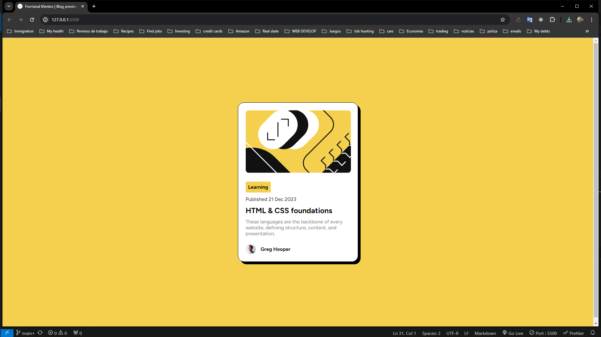

# Frontend Mentor - Blog preview card solution

This is a solution to the [Blog preview card challenge on Frontend Mentor](https://www.frontendmentor.io/challenges/blog-preview-card-ckPaj01IcS). Frontend Mentor challenges help you improve your coding skills by building realistic projects.

## Table of contents

- [Overview](#overview)
  - [The challenge](#the-challenge)
  - [Screenshot](#screenshot)
  - [Links](#links)
- [My process](#my-process)
  - [Built with](#built-with)
  - [What I learned](#what-i-learned)
  - [Continued development](#continued-development)
  - [Useful resources](#useful-resources)
- [Author](#author)
- [Acknowledgments](#acknowledgments)

**Note: Delete this note and update the table of contents based on what sections you keep.**

## Overview

### The challenge

Users should be able to:

- See hover and focus states for all interactive elements on the page

### Screenshot



### Links

- Solution URL: [https://henryapm.github.io/blog-preview-card-main/]

## My process

### Built with

- Semantic HTML5 markup
- CSS custom properties
- Flexbox
- Mobile-first workflow

### What I learned

I learn about centering texts next to images and align them to the center of that element that's next to it.
To see how you can add code snippets, see below:

```css
.author p {
  display: inline;
  vertical-align: middle;
}
```

### Continued development

I'd like to keep enhancing my skills to center elements and specially to position them in the place I need them, or in the place the project mark they need to exist in the page.

## Author

- Website - [Henry Paredes](https://henryapm.github.io/blog-preview-card-main/)
- Frontend Mentor - [@henryapm](https://www.frontendmentor.io/profile/henryapm)
